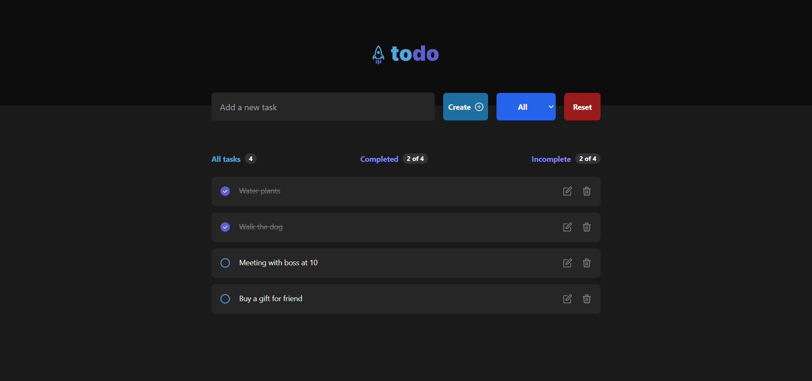

# React- Todo App

This is code for the todo app created using React and taken reference from the [Figma](https://www.figma.com/file/TPpfCmc2zp61ww6SWGnOgd/ToDo-Tutorial?node-id=101%3A98&t=k6oKZ03bIx9zx0Ti-0) design.

## Table of contents

- [Overview](#overview)
  - [The challenge](#the-challenge)
  - [Screenshot](#screenshot)
  - [Links](#links)
- [My process](#my-process)
  - [Built with](#built-with)
  - [Useful resources](#useful-resources)
- [Setup](#setup)
- [Author](#author)

## Overview

### The challenge

Users should be able to:

- View the optimal layout for the site depending on their device's screen size
- Create, edit, delete and sort todos
- Refreshing page does not delete data from todo list by saving a local copy

### Screenshot

### Links

- Solution URL: [Add solution URL here](https://your-solution-url.com)
- Live Site URL: [Add live site URL here](https://shibly-todo.netlify.app)

## My process

### Built with

- React
- React Hooks
- React Icons
- Tailwind CSS for design
- Flex box
- Mobile-first workflow

### Useful resources

- [React](https://reactjs.org/docs/getting-started.html) - Official website for React. Helps searching for concepts, hooks etc.

- [Tailwind CSS](https://tailwindcss.com/docs/installation) - Official website for Tailwind CSS. Helps searching for class names to add style.

## Setup

- run `npm i && npm run dev`

## Author

- LinkedIn - [Md Shibly Sadique Islam](https://www.linkedin.com/in/md-shibly-sadique-islam-092a10203/)
